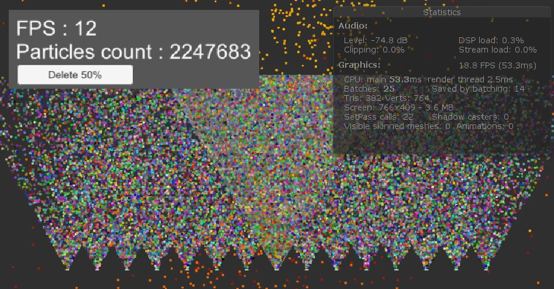

# Test project Particles System EdenGames

This is a test project of a custom particles System for intership from EdenGames. 

##### Unity Version advice: 2018.3.3f1

If you are passing this test, DON'T BLINDLY COPY, try doing this on your own. Plus this implementation use GPU which is not require. Otherwise, if you want to use my GPU Particles System feel free to use part of it or every thing that i have done.

## Description

This test require to [[Instructions]](Assets/Instructions-Internship.txt)

- Create a main menu with some specific features
- Correct some bugs in the CPU particles System
- Optimize the frame-rate so that it stop dropping and explain how to increase the frame-rate(which i have done)
- And implement some features on the particles 


## GPU implementations

This is just my implementation of a particle System entirely on GPU using custom Shader and Compute Shader. I did this to learn how use GPU and async* and on Unity correctly. The final goal was to minimize the impact on the FPS of this Particle System and to push it to the limit to see if it could be further improved.

The current FPS limit depend entirely on GPU capacity and is CPU friendly.

<figure style="text-align:center">
  
  <figcaption> GPU : NVIDIA GeForce GTX 1050 </figcaption>
</figure>

There should be no need to have 2 million particles as it could cover the entire screen multiple times.

The compute Shader for the spawn and update of the particles can be change easily to create other effects if needed.

If you need more variables in a Compute Shader you will have to create a new classes.


All the required Features work on the CPU and GPU implementation.																			

*GPU and async Functions used

```Unity
- ComputeShader / Shader / ComputeBuffer
- Graphics.DrawMeshInstancedIndirect 
- AsyncGPUReadback.Request
```


